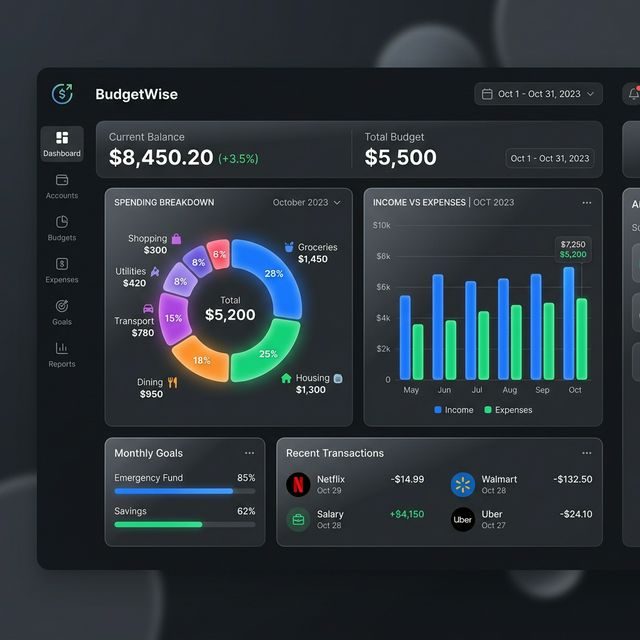

# 💰 BudgetWise - Advanced Financial Analytics Dashboard

**BudgetWise** is a comprehensive, modern personal finance management application designed to give you complete control over your financial health. Featuring a sleek, interactive analytics dashboard, tracking your income and expenses has never been easier or more visually insightful.



## ✨ Features

-   **Interactive Dashboard:** Real-time visualizations of your spending habits and financial standing.
-   **Expense Categorization:** Automated and manual grouping of spending into logical categories.
-   **Income vs. Expenses Tracking:** Grouped bar charts to compare your monthly earnings against spending.
-   **Spending History:** Detailed transaction logs with filtering and time-range options.
-   **Secure Authentication:** Robust user login and registration system.
-   **Responsive Design:** Optimized for both desktop and mobile devices.

## 🛠️ Technology Stack

-   **Backend:** Java, Spring Boot 3.3.0
-   **Database:** MongoDB
-   **Frontend:** HTML5, CSS3 (Vanilla), JavaScript (ES6+)
-   **Visualizations:** Chart.js for interactive analytics
-   **Authentication:** Spring Security with JWT

## 🚀 Getting Started

### Prerequisites

-   **Java 21** or later
-   **Maven 3.9+**
-   **MongoDB (Local or Atlas)**

### Installation

1.  **Clone the repository:**
    ```bash
    git clone https://github.com/vedant517/budgetwise.git
    cd budgetwise
    ```

2.  **Configure Environment:**
    Update your `src/main/resources/application.properties` with your MongoDB connection details.

3.  **Build and Run:**
    ```bash
    mvn clean spring-boot:run
    ```

4.  **Access the App:**
    Open [http://localhost:8080](http://localhost:8080) in your browser.

## 📊 Analytics Dashboard

The core of BudgetWise is it's powerful dashboard, featuring:
-   **Category-wise Spending (Pie Chart):** Instantly see where your money goes.
-   **Monthly Comparison (Bar Chart):** Track your financial progress month-over-month.
-   **Time-Range Filters:** Drill down into specific periods or view year-over-year growth.

---
*Maintained by [vedant517](https://github.com/vedant517)*
